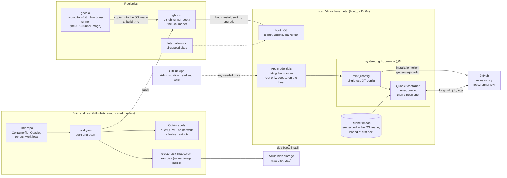
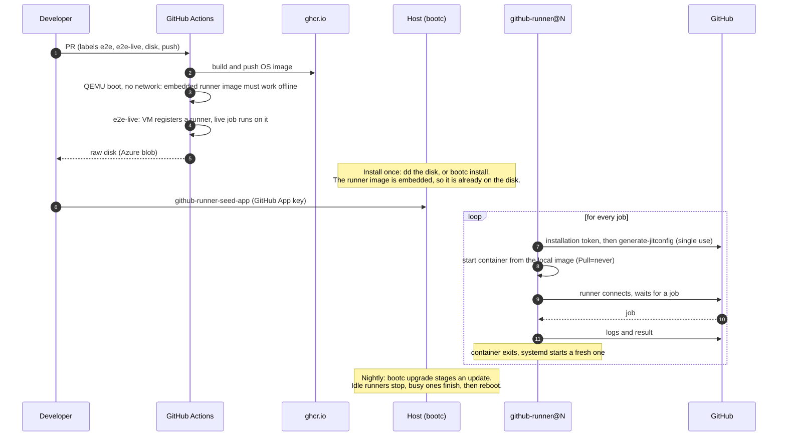

# Architecture and flow

High level. The sources are `architecture.mmd` and `flow.mmd`; GitHub renders the blocks below.

## Architecture

```mermaid
flowchart LR
    subgraph BUILD["Build and test (GitHub Actions, hosted runners)"]
        direction TB
        SRC["This repo<br/>Containerfile, Quadlet,<br/>scripts, workflows"]
        CI["build.yaml<br/>build and push"]
        E2E["Opt-in labels<br/>e2e: QEMU, no network<br/>e2e-live: real job"]
        DISK["create-disk-image.yaml<br/>raw disk (runner image inside)"]
        SRC --> CI --> E2E
        CI --> DISK
    end

    subgraph REG["Registries"]
        direction TB
        OS["ghcr.io<br/>github-runner-bootc<br/>(the OS image)"]
        RUN["ghcr.io<br/>talos-gitops/github-actions-runner<br/>(the ARC runner image)"]
        MIRROR["Internal mirror<br/>airgapped sites"]
    end

    DEST["Azure blob storage<br/>(raw disk, zstd)"]

    subgraph HOST["Host: VM or bare metal (bootc, x86_64)"]
        direction TB
        BOOTC["bootc OS<br/>nightly update, drains first"]
        BOUND[("Runner image<br/>embedded in the OS image,<br/>loaded at first boot")]
        subgraph UNITS["systemd: github-runner@N"]
            direction TB
            MINT["mint-jitconfig<br/>single-use JIT config"]
            CTR["Quadlet container<br/>runner, one job,<br/>then a fresh one"]
            MINT --> CTR
        end
        SEED["App credentials<br/>/etc/github-runner<br/>root only, seeded on the host"]
        BOUND --> CTR
        SEED --> MINT
    end

    GH["GitHub<br/>repos or org<br/>jobs, runner API"]
    APP["GitHub App<br/>Administration: read and write"]

    CI -- "push" --> OS
    DISK --> DEST
    DEST -- "dd / bootc install" --> HOST
    OS -- "bootc install, switch, upgrade" --> BOOTC
    RUN -- "copied into the OS image<br/>at build time" --> OS
    MIRROR -.-> BOOTC
    APP -. "key seeded once" .-> SEED
    MINT -- "installation token,<br/>generate-jitconfig" --> GH
    CTR <-- "long poll, job, logs" --> GH
```

## Flow

```mermaid
sequenceDiagram
    autonumber
    participant D as Developer
    participant CI as GitHub Actions
    participant R as ghcr.io
    participant H as Host (bootc)
    participant S as github-runner@N
    participant G as GitHub

    D->>CI: PR (labels e2e, e2e-live, disk, push)
    CI->>R: build and push OS image
    CI->>CI: QEMU boot, no network: embedded runner image must work offline
    CI->>CI: e2e-live: VM registers a runner, live job runs on it
    CI-->>D: raw disk (Azure blob)

    Note over H: Install once: dd the disk, or bootc install.<br/>The runner image is embedded, so it is already on the disk.
    D->>H: github-runner-seed-app (GitHub App key)

    loop for every job
        S->>G: installation token, then generate-jitconfig (single use)
        S->>S: start container from the local image (Pull=never)
        S->>G: runner connects, waits for a job
        G-->>S: job
        S->>G: logs and result
        Note over S: container exits, systemd starts a fresh one
    end

    Note over H: Nightly: bootc upgrade stages an update.<br/>Idle runners stop, busy ones finish, then reboot.
```
